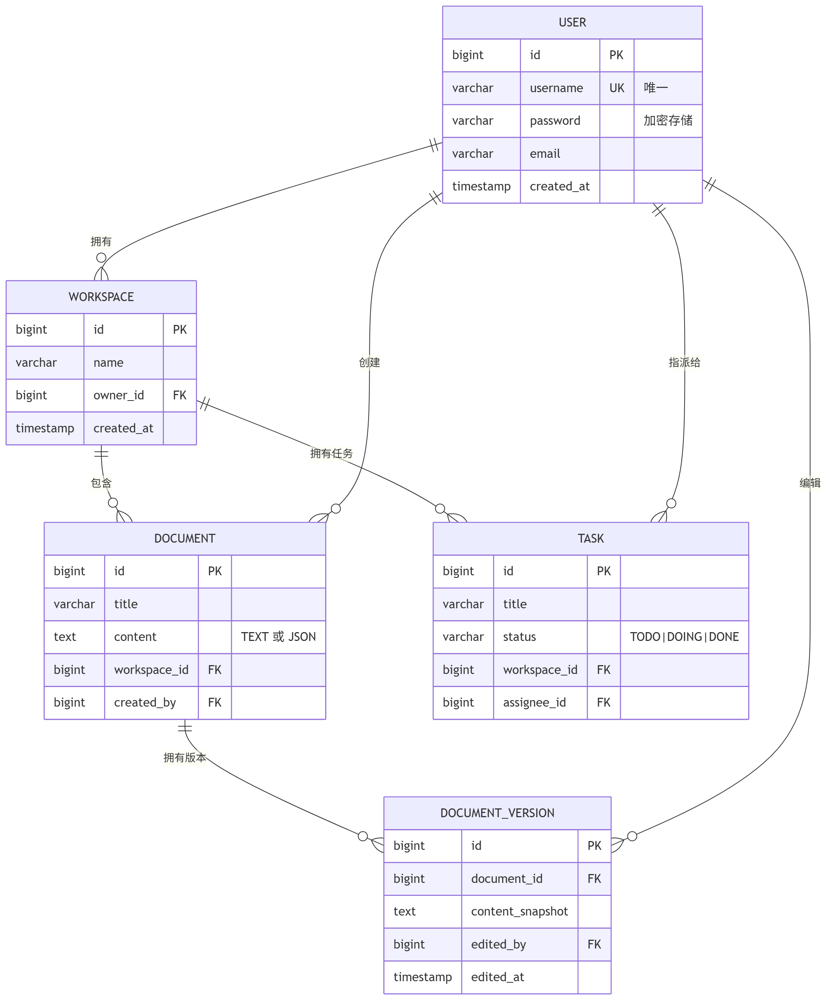

# 数据库 ER 图

## 表结构（已简化）

1. **users**（用户表）
    - id (PK)
    - username (唯一)
    - password (加密)
    - email
    - created_at

2. **workspaces**（工作空间）
    - id (PK)
    - name
    - owner_id (FK → users.id)
    - created_at

3. **documents**（文档）
    - id (PK)
    - title
    - content (TEXT 或 JSON)
    - workspace_id (FK)
    - created_by (FK → users.id)

4. **tasks**（任务）
    - id (PK)
    - title
    - status (TODO/DOING/DONE)
    - workspace_id (FK)
    - assignee_id (FK → users.id)

5. **document_versions**（实时协作版本）
    - id (PK)
    - document_id (FK)
    - content_snapshot
    - edited_by (FK)
    - edited_at